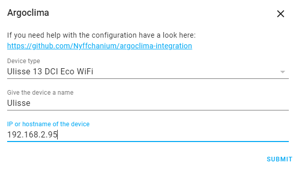

![Project Status][project-status-shield]
[![GitHub Release][releases-shield]][releases]
[![GitHub Activity][commits-shield]][commits]
[![License][license-shield]](LICENSE)

[![pre-commit][pre-commit-shield]][pre-commit]
[![Black][black-shield]][black]

[![hacs][hacsbadge]][hacs]
[![Project Maintenance][maintenance-shield]][user_profile]
[![BuyMeCoffee][buymecoffeebadge]][buymecoffee]

[![Discord][discord-shield]][discord]
[![Community Forum][forum-shield]][forum]

# Home Assistant Integration for Argoclima (Argo) climate control devices

This is an unoffical Home Assistant integration I wrote for my Argo Ulisse Eco, using the undocumented API used by the webapp.

## Supported devices and features

At the moment, only the device I own is supported. There is a good chance that other wifi capable devices use the same API thoug. So if you own a different device, please feel
| Feature | Implementation / Supported for | Ulisse 13 DCI Eco WiFi |
| ---------------------------- | ------------------------------ | ---------------------- |
| on / off | `climate` operation | ✓ |
| operation mode | `climate` operation | ✓ |
| eco mode | `climate` preset | ✓ |
| turbo mode | `climate` preset | ✓ |
| night mode | `climate` preset | ✓ |
| current temperature | `climate` | ✓ |
| set target temperature | `climate` | ✓ |
| set fan speed | `climate` fan mode | ✓ |
| set flap mode | x | - |
| set filter mode | x | - |
| set active timer | `select` | ✓ |
| use remote temperature \* | `switch` | x |
| timer configuration | x | ✓ |
| set current time and weekday | synchronize_time service | ✓ |
| device lights on / off | `light` | ✓ |
| display unit \*\* | `select` | ✓ |
| eco mode power limit | `number` | ✓ |
| firmware version | x | x |
| reset device | x | x |

[`text`] _platform the features is represented by in HA_\
[-] _not supported by the device_\
[x] _not implemented_

\* No idea whether that actually works. Could be that the remote would have to be in this mode as well for it to send values. Not tested.
\*\* This only affects the value displayed on the device and the webinterface.

## Installation

1. Using the tool of choice open the directory (folder) for your HA configuration (where you find `configuration.yaml`).
2. If you do not have a `custom_components` directory (folder) there, you need to create it.
3. In the `custom_components` directory (folder) create a new folder called `argoclima`.
4. Download _all_ the files from the `custom_components/argoclima/` directory (folder) in this repository.
5. Place the files you downloaded in the new directory (folder) you created.
6. Restart Home Assistant
7. In the HA UI go to "Configuration" -> "Integrations" click "+" and search for "Argoclima"

## Adding your device to Home Assistant

At the moment, the integration will communicate with the device locally. Cloud based communication is not supported.

### Set up WiFi

Follow the instructions provided with the device to connect it to your network. Once that is done, I highly recommend assigning it a static IP via router configuration. The integration is IP based and can not identify the device by any other means.

### Configuration

Select your device type, give it a name and enter the IP. The IP can be changed later.\

## Known Problems

If an API request is sent while another one is still in progress, the latter will be cancelled. It does not matter whether any of the requests actually changes anything. I.e. concerning parallel requests, only the most recent one is regarded by the device.\
Because of this, you sould not use the official wep app in addition to this integration.\
In case a value could not be changed, it will be sent again until it is confirmed. There are however settings that can only be written and thus there is no way to check if they have been accepted. This affects current time and weekday, timer configuration and reset. Those values will only be sent once.

## Contributions are welcome!

If you want to contribute to this please read the [Contribution guidelines](CONTRIBUTING.md)

## Credits

This project was generated from [@oncleben31](https://github.com/oncleben31)'s [Home Assistant Custom Component Cookiecutter](https://github.com/oncleben31/cookiecutter-homeassistant-custom-component) template.

Code template was mainly taken from [@Ludeeus](https://github.com/ludeeus)'s [integration_blueprint][integration_blueprint] template

---

[argoclima]: https://github.com/nyffchanium/argoclima-integration
[black]: https://github.com/psf/black
[black-shield]: https://img.shields.io/badge/code%20style-black-000000.svg?style=for-the-badge
[project-status-shield]: https://img.shields.io/badge/project%20status-experimental-red.svg?style=for-the-badge
[buymecoffee]: https://www.buymeacoffee.com/nyffchanium
[buymecoffeebadge]: https://img.shields.io/badge/buy%20me%20a%20coffee-donate-yellow.svg?style=for-the-badge
[commits-shield]: https://img.shields.io/github/commit-activity/y/nyffchanium/argoclima-integration.svg?style=for-the-badge
[commits]: https://github.com/nyffchanium/argoclima-integration/commits/master
[hacs]: https://hacs.xyz
[hacsbadge]: https://img.shields.io/badge/HACS-Custom-orange.svg?style=for-the-badge
[discord]: https://discord.gg/Qa5fW2R
[discord-shield]: https://img.shields.io/discord/330944238910963714.svg?style=for-the-badge
[exampleimg]: example.png
[forum-shield]: https://img.shields.io/badge/community-forum-brightgreen.svg?style=for-the-badge
[forum]: https://community.home-assistant.io/
[license]: https://github.com/nyffchanium/argoclima-integration/blob/master/LICENSE
[license-shield]: https://img.shields.io/github/license/nyffchanium/argoclima-integration.svg?style=for-the-badge
[maintenance-shield]: https://img.shields.io/badge/maintainer-%40nyffchanium-blue.svg?style=for-the-badge
[pre-commit]: https://github.com/pre-commit/pre-commit
[pre-commit-shield]: https://img.shields.io/badge/pre--commit-enabled-brightgreen?style=for-the-badge
[releases-shield]: https://img.shields.io/github/release/nyffchanium/argoclima-integration.svg?style=for-the-badge
[releases]: https://github.com/nyffchanium/argoclima-integration/releases
[user_profile]: https://github.com/nyffchanium
